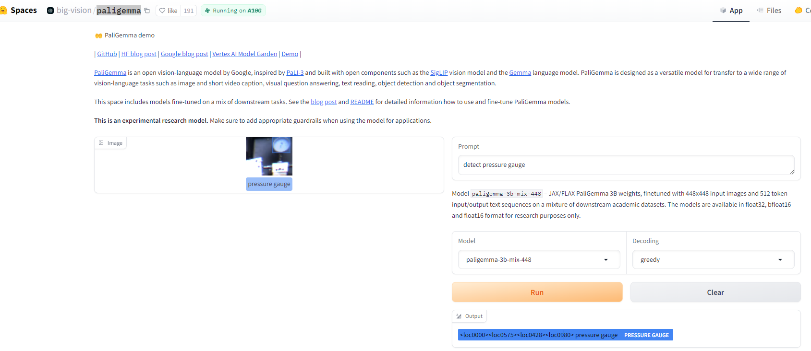
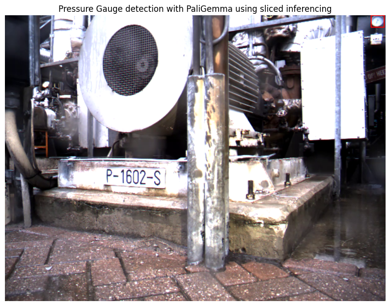
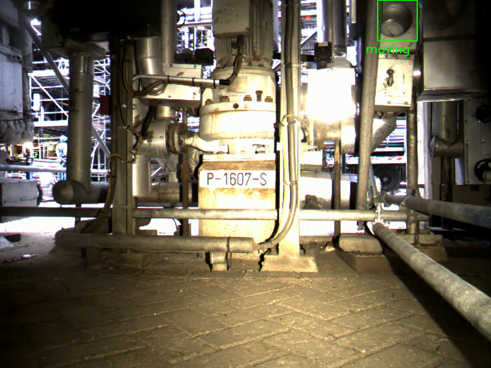
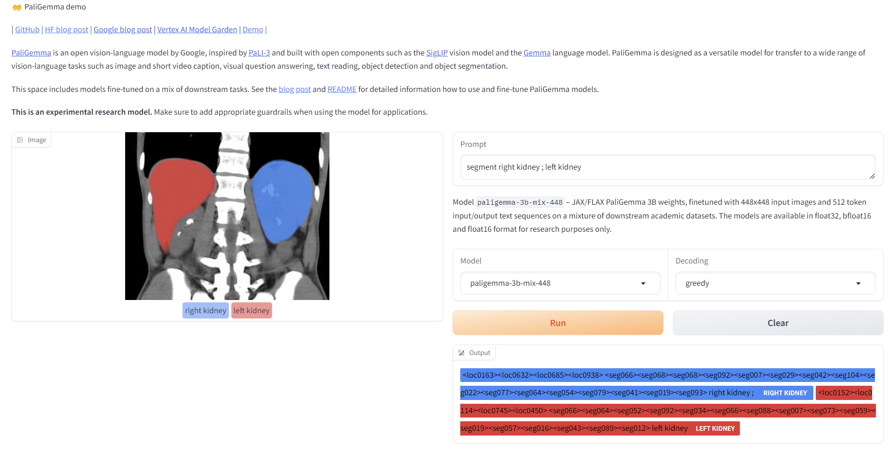
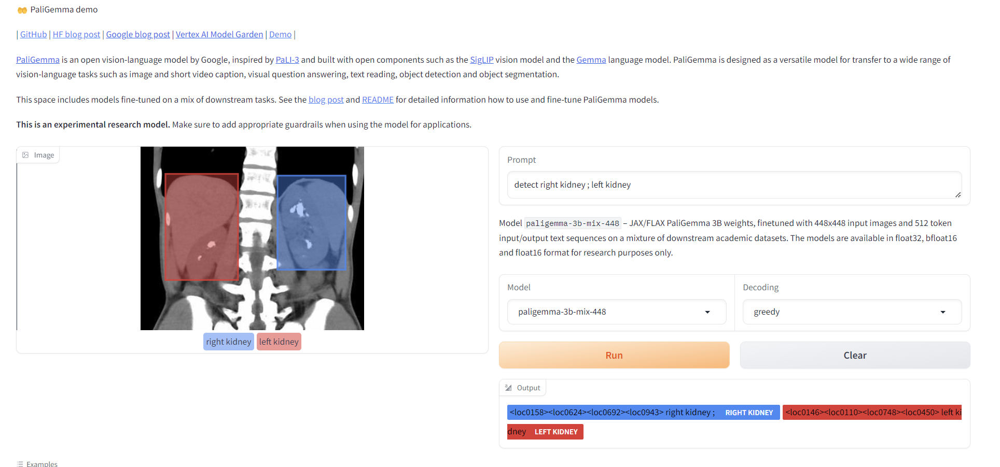
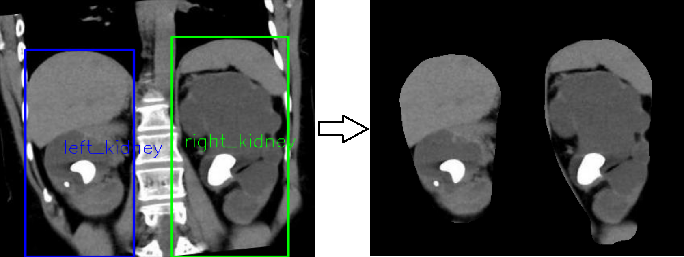
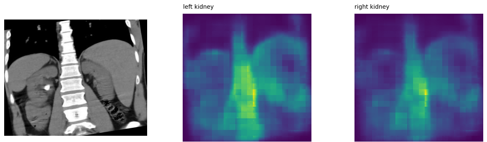
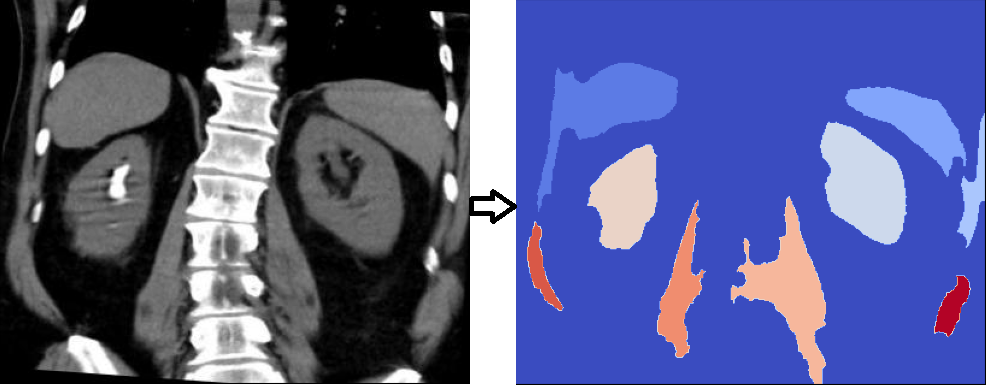

# unsupervision

- [Project Setup](#setup)
- [Moving needle prediction](#task-1)
- [Kidney segmentation](#task-2)

## Project Setup
 - Makefile targets are defined for project setup. 
 - To create a new environment execute: `make environment`
 - To update an existing environment execute: `make update_environment`
 - To install notebook dependencies run: `make jupyter-install`
 - To start a notebook instance run: `make jupyter-start`. This will start a jupyter instance as a background thread. 
 - To detect a moving needle run the `predict_moving_needle` target in Makefile after setting up necessary variable inputs. 

## Task - 1 Predict moving needle in a pressure gauge

### Detect Pressure Gauge
- Here first we tried to implement out-of-the-box gauge detector. 
- For this we tried the latest PaliGemma vision-language model from google. 

- As the original image size is large, we see that initial trials with full input image did not work. 
- The model resizes the input image to 448x448 (we are using paligemma-3b-mix-448)
- So we implemented a slice-based inferencing where we yield slices from the larger input image and do prediction on slices. 
- The sliced predictions are then merged into the large image. 
- Final result for sliced-based inferecing gives below result for frame from 'needle2.mp4'

### Moving Needle Prediction

- For this task we are using the bbox obtained from the paligemma model. 
- Here we use the concept of moving average frame on a selected window length to find diff between previous historical average and current frame. 
- We select a window size of 25 (i.e. ~1sec) and take average of all frames(roi) in the window. This gives us historical average_gauge. 
- We then select the gauge from the current frame, and check for absolute difference betweeen the historical average_gauge and current_gauge. 
- If the needle is stationary the historical average gauge should be same as current gauge. 
- Here we take into consideration that the neddle may not move considerably if adjacent frames are compared. 
- So, we select a historical average for comparison here. 
- results for the 2 videos are present in data folder. 

- More experiments are needed to determine if the current algorithm is robust or not. 

### Future Task
 - We can train a Yolo model with OBB to detect pressure gauge and needle. 
 - Based on the detected needle location centroid we can determine if the needle is moving or not. 

## Task - 2 Kidney Segmentation

 - Here we want to do instance segmentation of the kidneys - left kidnet and right kidney
 - For this I first tried PaliGemma model to verify results with pretrained model:

 - We also setup the PaliGemma model locally to verify its performace and runtime complexity:

 

 - As we see the mask obtained from PaliGemma is not accurate, I also tried other approches like CLIPSeg

 

 - But botht the models did not gave acceptable results. 
 - After this we tried traiditional CV based segmentation models. 
 - The current algorithm is a WIP and it is just to demostrate the possibility of what can be done with traditional CV based techniques. 
 - The result from traditional CV pipeline is: 

 

 ### Future task:
  - For custom model, an ideal approach here would be to train a Unet-type model like Deeplabv3 on a use-case specific dataset. 
  - If we want to use a foundation model for this task, I would recommend finetuning PaliGemma using vision and text features from BioMedClip. 

